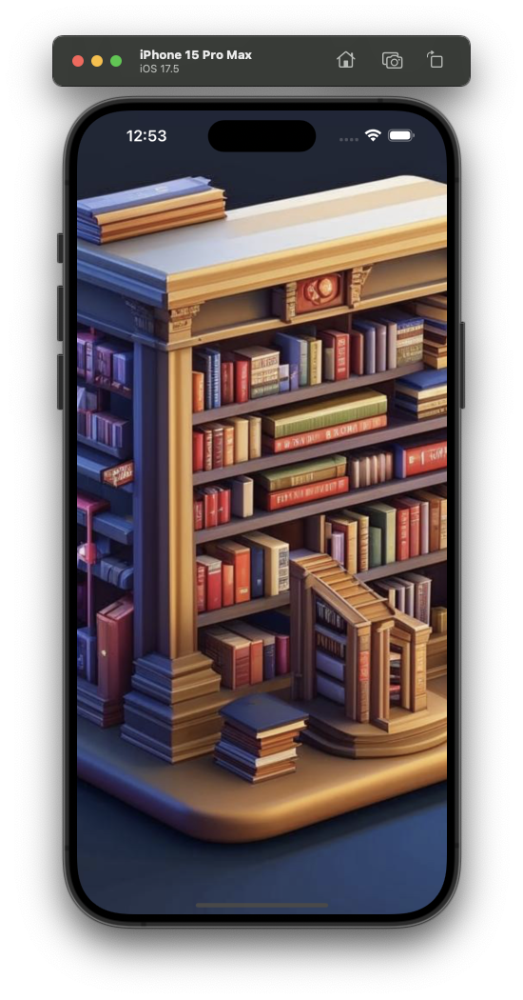
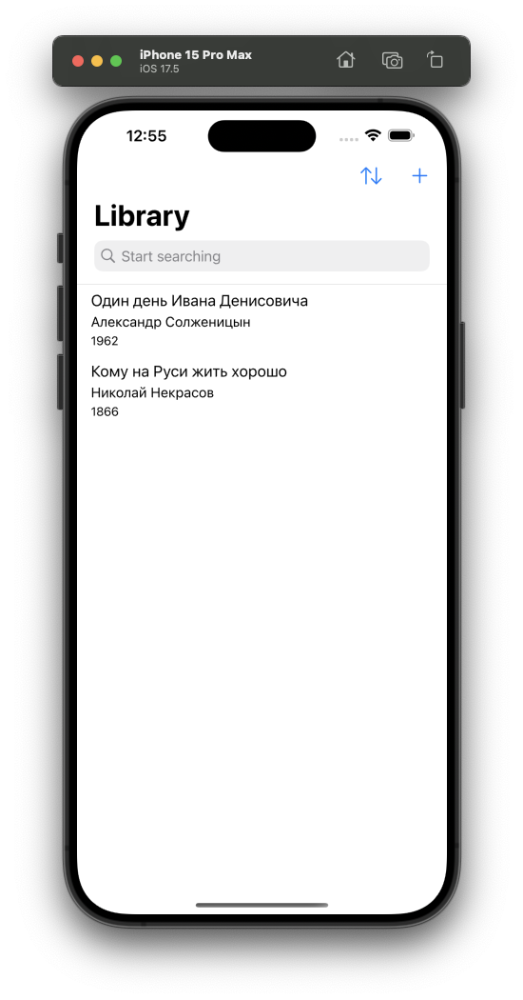

# Library iOS App

## Task description

The task was to write simple 2 screens iOS Library app.
Main screen should be able to show books list, edit book(s), sort books and search specific book by name, author or publication year.
Second screen will be called from Main in case if user wants to create new book or edit / delete existing one.
No 3rd party libraries should be used, but only UIKit, Swift, CoreData and DiffableDataSource if possible.

## Solution notes

- :trident: MMVM + Coordinator architecture (model->view->view model)
- :book: Swift with minor improvments / extension (well, more or less :blush:)
- :cd: CoreData
- :card_file_box: UICollectionViews with DiffableDataSources and Compositional layouts

## A picture is worth a thousand words

